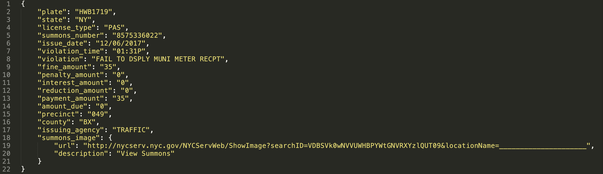
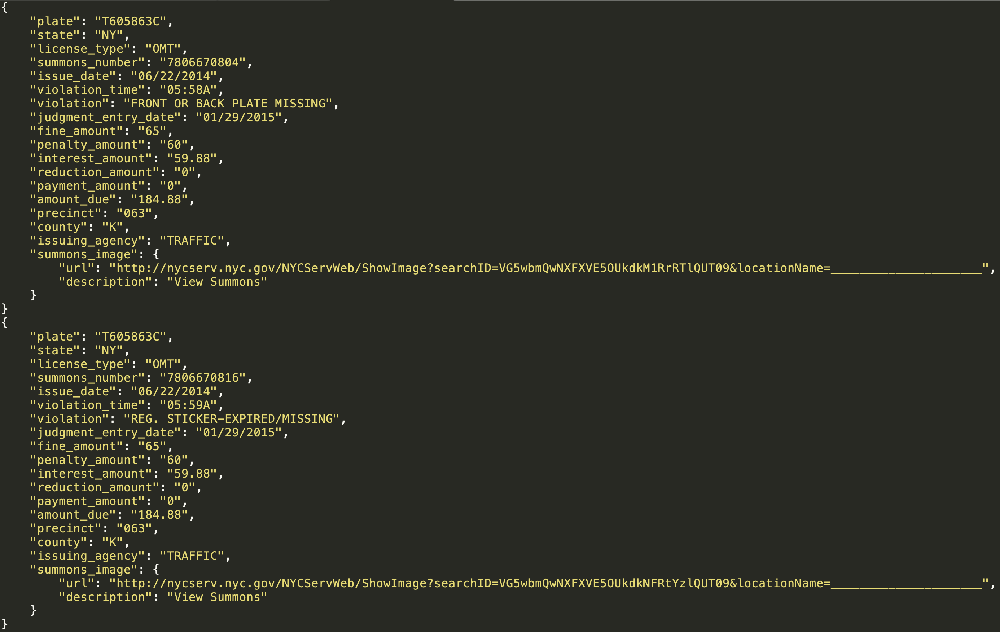
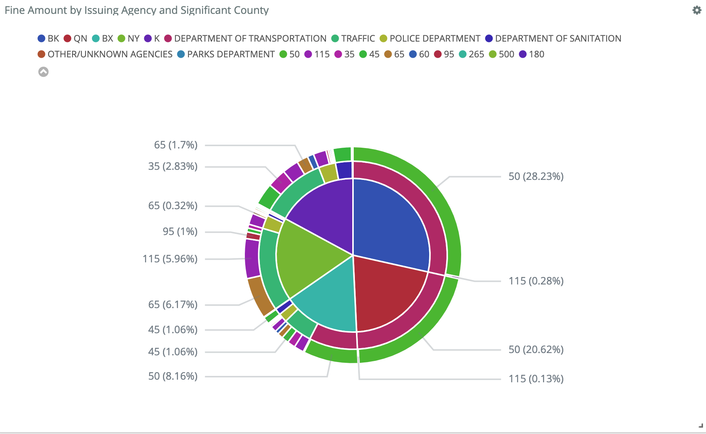
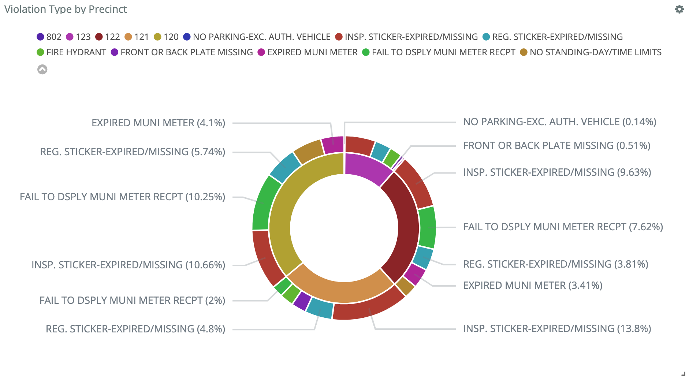
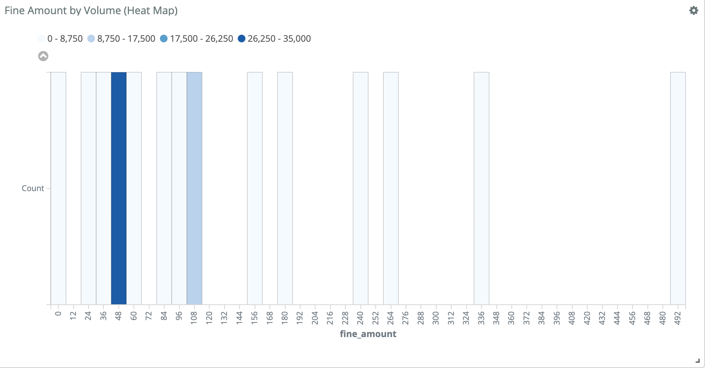
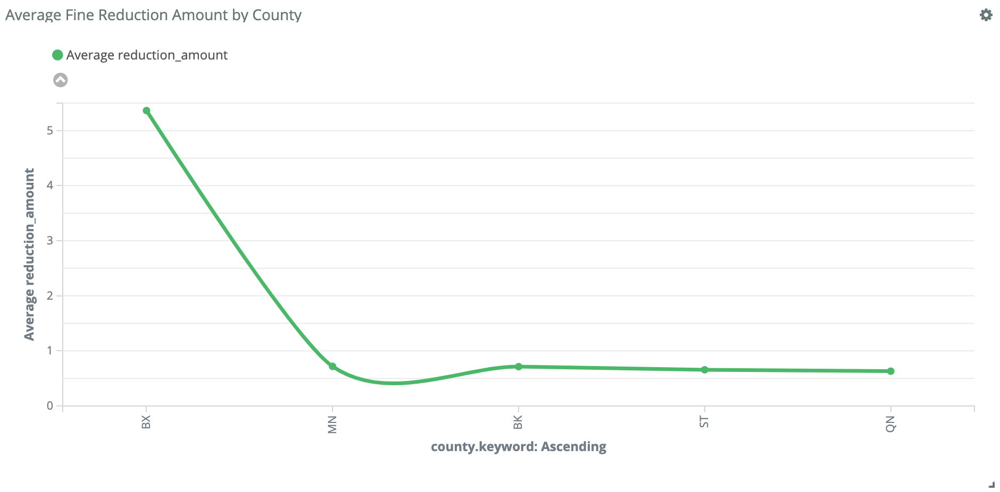
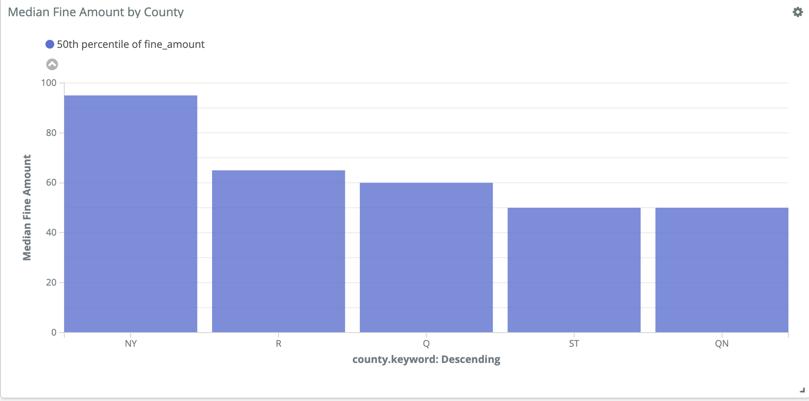

# Parking Violations Analysis

[Dataset Link](https://data.cityofnewyork.us/resource/nc67-uf89.json)

# Executive Summary
This analysis will load and then analyze a subset (n=200,000) of a dataset containing millions of NYC parking violations since January 2016. In completing this analysis, the following skills will be leveraged: principles of containerization, terminal navigation, python scripting, artifact deployment, AWS EC2 provisioning, and Kibana. An overview of the vast majority of steps taken to conduct this analysis are depicted below for the reader. Towards the conlusion, we will visualize a few intersting insights/relationships by leveraging Kibana.
____________________________________________________________________________________________________________________________

# Part 1: Python Scripting

### Create the necessary folders and cd into the directory. Once the environment is properly contained, we can begin deployment.

1) Login to docker via terminal:\
&nbsp;&nbsp;&nbsp;&nbsp;- docker login --username=krm444
&nbsp;&nbsp;&nbsp;&nbsp;-  test
2) Build the image in terminal:\
&nbsp;&nbsp;&nbsp;&nbsp;- docker build -t bigdata1:1.0 .
  
3) Obtain the UUID of the newly built image:\
&nbsp;&nbsp;&nbsp;&nbsp;- docker images | grep bigdata1

4) Tag the image (UUID) with 2 elements: dockerhub username (make sure username is lowercase) + version number\
&nbsp;&nbsp;&nbsp;&nbsp;- docker tag {UUID} krm444/bigdata1:1.0

5) Push the docker image WITHOUT the version number:\
&nbsp;&nbsp;&nbsp;&nbsp;- docker push krm444/bigdata1

6) Run it to visualize data:\
&nbsp;&nbsp;&nbsp;&nbsp;- docker run -e APP_KEY={YOUR_APP_KEY} -it bigdata1:1.0 python -m main --page_size=4 --num_pages=4 --     output=results.json

## Following are two sample outputs:

### 1) page_size = 1 and num_pages = 1

### 2) page_size = 2 and num_pages = 1

### That's all folks, it should be deployed to Dockerhub. On your docker, just click into the repo to make sure.
____________________________________________________________________________________________________________________________

# Part 2: Loading into ElasticSearch

### SSH into an AWS EC2 instance. Leverage docker-compose to bring up a service that encapsulates your bigdata1 container and an elastic search container and ensures they are able to interact through a few curl requests in terminal against http://localhost:9200. 

1) Create an instance on AWS EC2 with the necessary parameters and download the pem file

2) cd into the folder containing your .pem file (I put it inside my Part_2 document)

3) make sure your .pem file is read only\
&nbsp;&nbsp;&nbsp;&nbsp;- chmod 0400 ./{PEM FILE YOU DOWNLOADED}
  
4) SSH into EC2, this should prompt the command line to initiate with ubuntu@ip-###-##-##-###\
&nbsp;&nbsp;&nbsp;&nbsp;- ssh -i ./{PEM FILE YOU DOWNLOADED} @ubuntu{YOUR IPv4 Public IP}\

5) Now if you do not have docker installed, install it. If you do, feel free to skip this step:
   (Note: to check if you have docker installed simply type "docker" in the term)\
&nbsp;&nbsp;&nbsp;&nbsp;- sudo apt install docker.io

6) Loginto Docker through EC2:\
&nbsp;&nbsp;&nbsp;&nbsp;- sudo docker login --username=krm444
  
7) Pull the Docker image into EC2 (command following "sudo" can be obtained directly from your Dockerhub):\
&nbsp;&nbsp;&nbsp;&nbsp;- sudo docker pull krm444/bigdata1:1.0 

8) Run the container!:\
&nbsp;&nbsp;&nbsp;&nbsp;- sudo docker run -e APP_KEY={YOUR_APP_KEY} -v $(pwd):/app/out -it krm444/bigdata1:1.0 python -m main --page_size=1 --num_pages=2 --output=results.json
  
9) Run a few curl requests in terminal against http://localhost:9200 to ensure interaction. I have committed an output.txt file that contains a few curl requests. Following command was executed in terminal:

&nbsp;&nbsp;&nbsp;&nbsp;- curl -o output.txt http://localhost:9200/opcv-index/_search\?q\=state:NY\&size\=10000 

____________________________________________________________________________________________________________________________
# Part 3: Visualizing and Analysis on Kibana
1) cd into Part_3
2) docker-compose build pyth
3) docker-compose up -d
4) Loaded 200,000 parking Violations to ElasticSearch:\
&nbsp;&nbsp;&nbsp;&nbsp;- docker-compose run -e APP_KEY={YOUR_APP_KEY} -v $(pwd):/app/out pyth python -m main --page_size=100 --num_pages=2000 --output=./results.json
5) docker-compose down

_I conducted an anlysis around 2016 because during that year I actually had to drive pretty often over the weekends. So, naturally, I was curious._ Below are exploratory data analysis diagrams I obtained through Kibana.

1) _Fine Amount by Issuing Agency With Respect to County_

2) _Violation Type by Precinct_

3) _Fine Amount by Volume (Heat Map)_
Interestingly this is skewed heavily, the kurtosis on this must be very high!

4) _Average Fine Reduction by County_

5) _Median Fine Amount by County_

